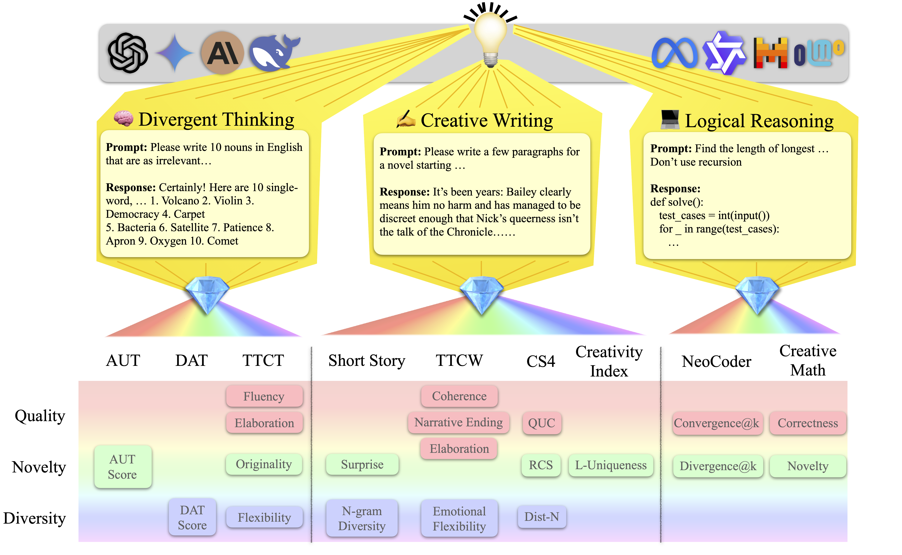
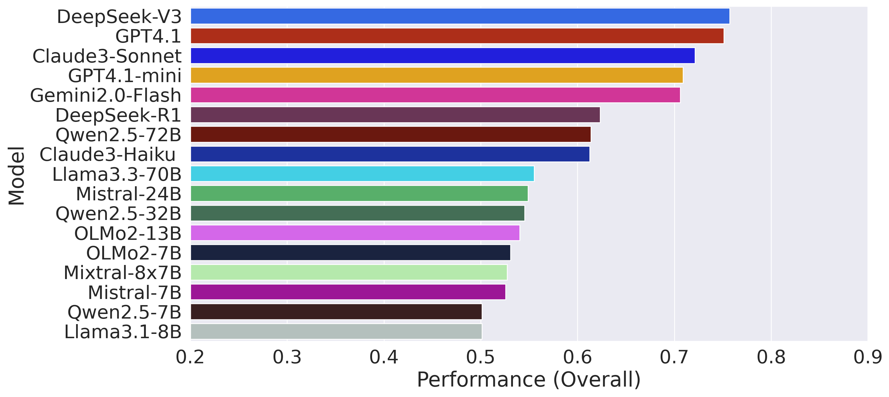
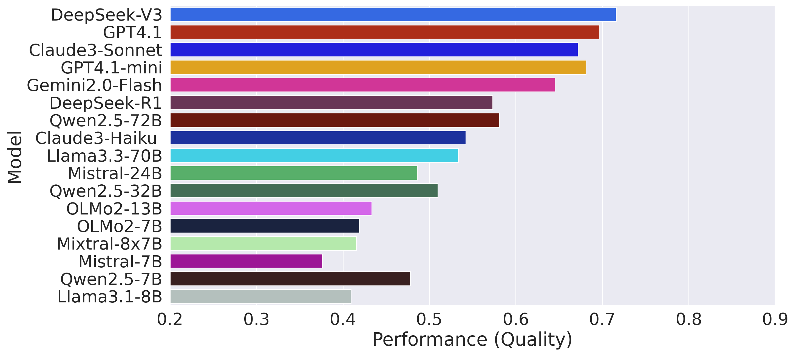
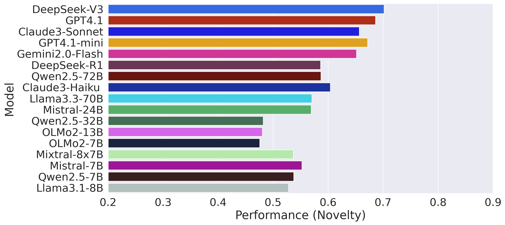
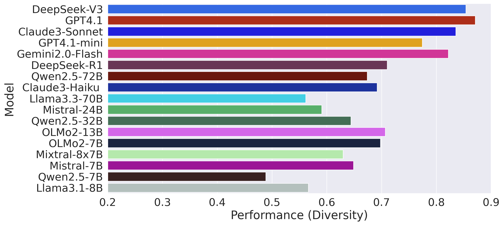
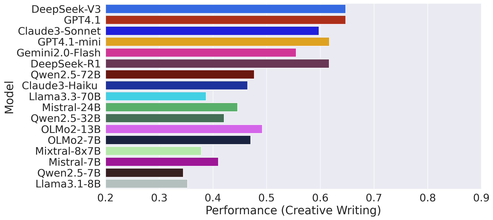
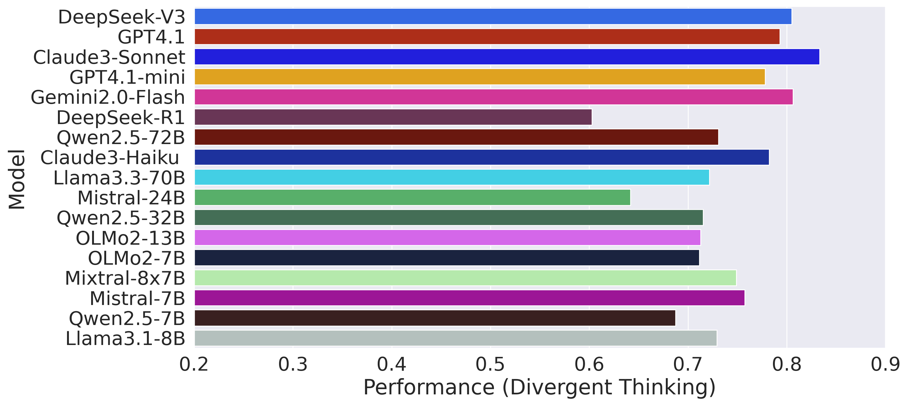
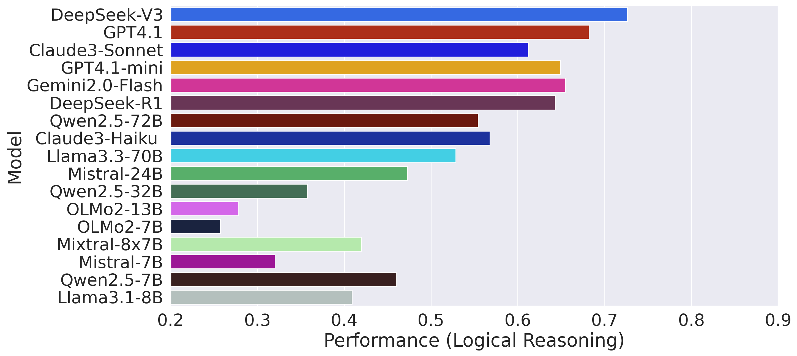

<!-- Hero -->

    <h1>CreativityPrism</h1>
    
A benchmark for creative reasoning in LLMs — Quality · Novelty · Diversity

    

        <a href="." target="_blank" rel="noopener">📄 arXiv (coming soon!)</a>
        <a href="https://www.kaggle.com/datasets/a916e717ce0375e9ca3e31a53d1f4b37f29266057027e3bfb0140b31cc6dcc21" target="_blank" rel="noopener">🗂 data</a>
        <a href="https://github.com/joeyhou/creativityprism" target="_blank" rel="noopener">💻 code</a>
    

<!-- KPIs (edit the numbers or compute them later) -->

    

17

LLMs

    

9

Datasets

    

3

Dimensions

    

21

Metrics

## What is CreativityPrism?
INTRODUCTION

---

    <h2 id="overview">Overview</h2>
    <figure>
        
        <figcaption>Domains, datasets, and metric dimensions.</figcaption>
    </figure>

  

    

      <h2 id="leaderboard">Leaderboard</h2>
      
Last updated: —

    

  

  <table id="board" class="paper-table" style="width:100%">
    <thead>
      <tr>
        <th class="th-model" data-key="model" data-type="text">Model</th>
        <th data-key="overall" data-type="num">Overall</th>
        <th data-key="quality" data-type="num">Quality</th>
        <th data-key="novelty" data-type="num">Novelty</th>
        <th data-key="diversity" data-type="num">Diversity</th>
        <th data-key="cw" data-type="num">Creative&nbsp;Writing</th>
        <th data-key="dt" data-type="num">Divergent&nbsp;Thinking</th>
        <th data-key="lr" data-type="num">Logical&nbsp;Reasoning</th>
      </tr>
    </thead>
    <tbody></tbody>
  </table>

---

    <h2 id="headline-results">Overall Results</h2>
    <figure>
        
        <!-- <figcaption> Overall performance across evaluated models.</figcaption> -->
    </figure>

## Detailed Results
=== "Results by Creativity Dimension"

    === "Quality"
        <figure>
          
        </figure>

    === "Novelty"
        <figure>
          
        </figure>

    === "Diversity"
        <figure>
          
        </figure>

=== "Results by Domain"

    === "Creative writing"
        <figure>
          
        </figure>

    === "Divergent thinking"
        <figure>
          
        </figure>

    === "Logical reasoning"
        <figure>
          
        </figure>

